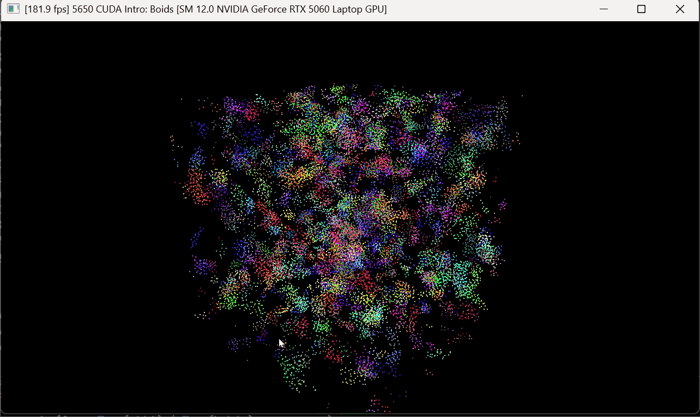
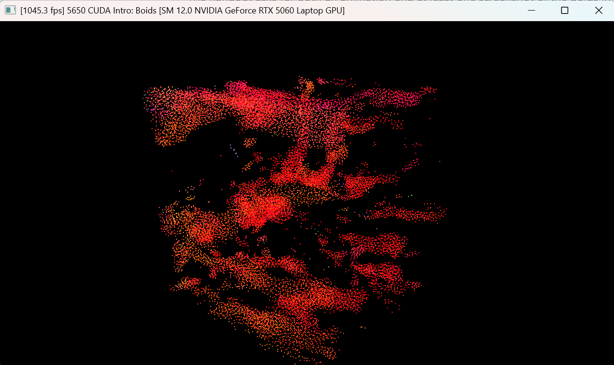
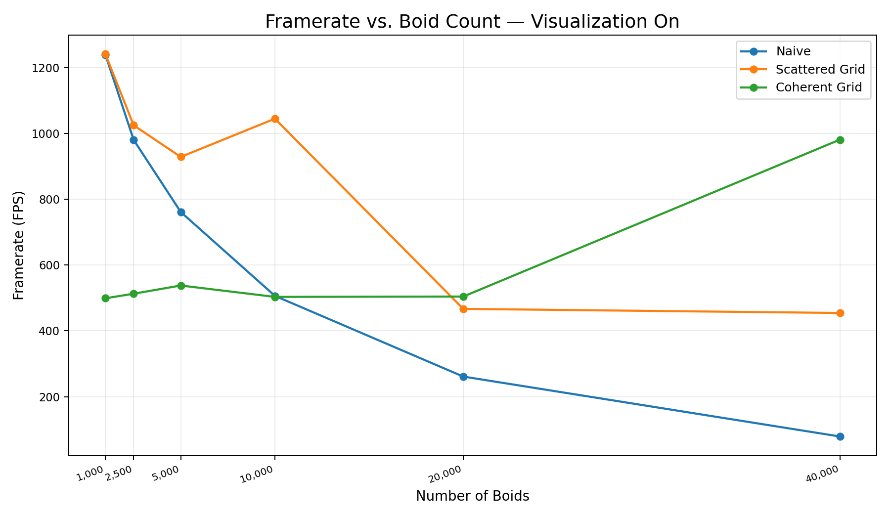
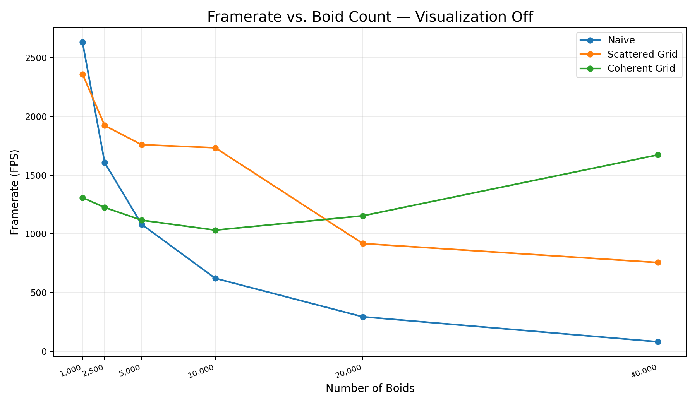
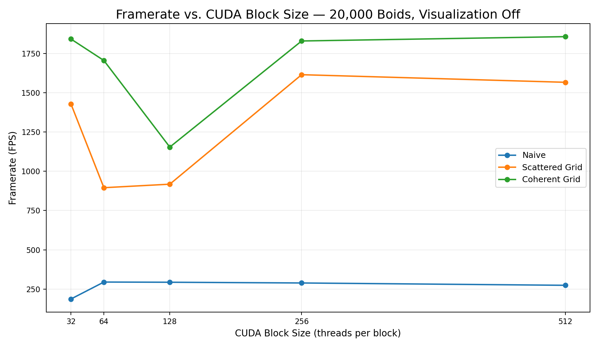
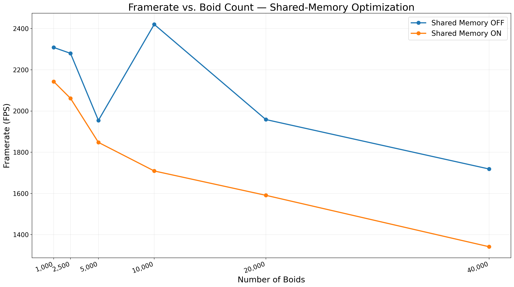

**University of Pennsylvania, CIS 5650: GPU Programming and Architecture,
Project 1 - Flocking**

* Ethan Yang
  * [GitHub](https://github.com/eyang72004)
* Tested on: Windows 11 (Personal Laptop), Intel(R) Core(TM) Ultra 9 275HX, 32 GB DDR5 RAM, NVIDIA GeForce RTX 5060 Laptop GPU

> **Note:** All required implementation and performance results documented below were completed and collected before attempting the extra credit optimizations. I documented extra credit work separately at the end of this README.

## Boids Simulation



*20,000-boid simulation using the scattered uniform-grid implementation with visualization enabled and `DT = 0.2`.*





## Implementation

This project implements a CUDA flocking simulation using the three boid rules: cohesion, separation, alignment. I implemented the three required approaches:

1. **Naive:** Each boid checks every other boid when computing its velocity update.
2. **Scattered Uniform Grid:** Boids are assigned grid-cell indices and sorted by cell index. Cell start/end indices restrict the neighbor search to nearby grid cells, while the position and velocity arrays remain in their original order and the sorted particle-index array is used as an indirection. 
3. **Semi-Coherent Uniform Grid:** After sorting the grid indices and particle indices, I reordered the position and velocity data into grid-cell order. Neighbor searches can then directly access contiguous entries within the relevant cells rather than using the additional particle-index indirection.

For the required baseline grid implementation, the cell width is twice the maximum boid interaction radius. This allows the neighbor search to inspect at most 8 relevant cells in 3D. I separately benchmarked the alternative cell width equal to the interaction radius, which requires checking 27 cells.


# Performance Analysis

## Benchmark Methodology

I performed performance testing in **Release x64** mode on an **NVIDIA GeForce RTX 5060 Laptop GPU**, with **Vertical Sync disabled in the NVIDIA Control Panel**. The simulation timestep was `DT = 0.2`.

For the boid-count experiment, I tested these:
`1,000`, `2,500`, `5,000`, `10,000`, `20,000`, and `40,000` boids.


The default CUDA block size was 128 threads except during the block-size experiment. I measured performance using the application's existing wall-clock framerate meter. Both `VISUALIZE = 1` and `VISUALIZE = 0` were tested for the boid-count experiment.

For most configurations, I recorded five settled FPS readings and report their mean. I collected additional readings for a few noisy configurations. I also recorded some early visualization-on configurations as single settled readings, so I would not say that those values should be interpreted as having the same sampling depth as every repeated measurement.

These are application-level FPS measurements rather than isolated CUDA-kernel timings. In particular, even with `VISUALIZE = 0`, the current application still maps and unmaps its OpenGL buffers in `runCUDA()`. I did not use CUDA events for these measurements.


## 1. Effect of Increasing the Number of Boids

The measured framerates were these:

| Boids | Naive (Vis. On) | Scattered (Vis. On) | Coherent (Vis. On) | Naive (Vis. Off) | Scattered (Vis. Off) | Coherent (Vis. Off) |
|---:|---:|---:|---:|---:|---:|---:|
| 1,000 | 1240.30 | 1242.00 | 499.23 | 2630.82 | 2360.45 | 1308.48 |
| 2,500 | 981.20 | 1025.58 | 513.12 | 1607.54 | 1922.68 | 1225.16 |
| 5,000 | 761.80 | 929.28 | 538.08 | 1081.68 | 1759.70 | 1116.78 |
| 10,000 | 506.60 | 1045.50 | 503.46 | 621.36 | 1733.18 | 1031.66 |
| 20,000 | 261.10 | 466.96 | 504.52 | 293.90 | 917.74 | 1153.78 |
| 40,000 | 78.80 | 454.56 | 981.84 | 81.26 | 755.78 | 1672.40 |


### Visualization ON



### Visualization OFF




### Analysis

The **naive implementation shows the clearest degradation as the boid count increases**. With visualization disabled, it fell from 2630.82 FPS at 1000 boids to only 81.26 FPS at 40,000 boids. This behavior is consistent with the structure of the naive algorithm: each boid considers every other boid during the neighbor search, so the number of pairwise comparisons grows approximately quadratically with the number of boids.

The grid implementations avoid searching the complete boid population for every boid; however, that reduction is not free. Each grid-based frame also requires grid-index computation, sorting, cell-range construction, and, for the semi-coherent implementation, data reordering. At small populations, those preprocessing costs can outweigh the savings from reducing neighbor comparisons. This is evident at 1,000 boids, where the naive implementation is competitive with or faster than the grid approaches. As the boid count increases, however, the quadratic growth of the naive all-pairs search becomes dominant and the grid methods pull substantially ahead.

For instance, if we disable visualization at 40,000 boids, the naive implementation measured 81.26 FPS, compared with 755.78 FPS for the scattered grid and 1672.40 FPS for the coherent grid.

The grid measurements are not perfectly monotonic. Most notably, the coherent implementation increased substantially at 40,000 boids in both the visualization-on and visualization-off measurements. I have retained this measured result rather than smoothing or discarding it. Since these measurements use whole-application FPS rather than per-kernel CUDA event timings, I do not have sufficient evidence to attribute that increase to a specific GPU mechanism. I reckon that more fine-grained profiling would be necessary to determine its exact cause.

Visualization generally reduces the amount of simulation throughput because visualization-enabled frames additionally copy boid data to the VBO and perform rendering. The comparison should nevertheless be interpreted as application-level performance rather than pure rendering overhead, especially given the variability visible in several grid measurements.

## 2. Effect of CUDA Block Size and Block Count

For this experiment, I fixed the simulation at **20,000 boids**, used `VISUALIZE = 0`, and tested block sizes of 32, 64, 128, 256, and 512 threads.

Since the boid count remained fixed, changing the block size also changed the number of blocks launched according to:

`blockCount = ceil(N / blockSize)`

| Block Size (threads) | Block Count | Naive FPS | Scattered FPS | Coherent FPS |
|---:|---:|---:|---:|---:|
| 32 | 625 | 187.16 | 1428.70 | 1841.36 |
| 64 | 313 | 295.10 | 895.38 | 1704.66 |
| 128 | 157 | 293.90 | 917.74 | 1153.78 |
| 256 | 79 | 289.22 | 1614.36 | 1828.84 |
| 512 | 40 | 274.44 | 1565.98 | 1856.36 |





### Analysis

Changing the block size changes both the number of threads grouped into each CUDA block and, for a fixed number of boids, the number of blocks required to cover the simulation.

We see that the **naive implementation** performed best around 64-128 threads per block in these measurements. Its mean FPS increased from 187.16 at a block size of 32 to 295.10 at 64, remained similar at 128, and then gradually declined to 274.44 at 512.


We also see that the **scattered and coherent grid implementations were considerably more non-monotonic**. For instance, the scattered implementation measured 1428.70 FPS at a block size of 32, fell to 895.38 at 64 and 917.74 at 128, then increased to 1614.36 at 256. The coherent implementation similarly reached its lowest measured value at 128 threads and its highest at 512 threads.


I therefore was not able to identify one block size that was best for all three implementations. The naive implementation was relatively stable from 64 through 256 threads, while the grid implementations showed much larger non-monotonic changes. A grid-based simulation step contains several different operations, including grid-index computation, sorting, cell-range construction, neighbor searching, and, for the coherent version, data reordering. Changing the global block size therefore affects several CUDA kernels with different workloads rather than one uniform computation. Since I measured the complete application frame, these results show the overall performance effect of changing block size but do not isolate which kernel is responsible for each peak or decline.


## 3. Semi-Coherent Uniform Grid Performance

The semi-coherent grid did produce performance improvements over the scattered grid at some boid counts, but **the improvement was not consistent across the complete benchmark range**.


With visualization disabled, we measured these:

| Boids | Scattered FPS | Coherent FPS | Faster Implementation |
|---:|---:|---:|:---|
| 1,000 | 2360.45 | 1308.48 | Scattered |
| 2,500 | 1922.68 | 1225.16 | Scattered |
| 5,000 | 1759.70 | 1116.78 | Scattered |
| 10,000 | 1733.18 | 1031.66 | Scattered |
| 20,000 | 917.74 | 1153.78 | Coherent |
| 40,000 | 755.78 | 1672.40 | Coherent |


At 20,000 boids, the coherent implementation was approximately **25.72% faster** than the scattered implementation in the visualization-off measurements. At 40,000 boids, the measured difference was substantially larger. However, from 1,000 through 10,000 boids, the scattered implementation was faster.


I expected the semi-coherent representation to have the potential to improve neighbor-search performance as the reordered position and velocity arrays place boids from the same grid cells contiguously in memory. The scattered implementation instead uses the sorted particle-index array as an additional indirection into the original position and velocity arrays.

However, coherence is not free: the semi-coherent implementation must reorder the boid data after sorting during every simulation step. Therefore, improved memory locality during the neighbor search must compensate for the additional reordering work. My measurements suggest that this tradeoff did not consistently favor the coherent implementation at smaller and medium population sizes.


The 40,000-boid coherent result is unusually high relative to the rest of its curve, so I retained it rather than smoothing it away. The overall crossover is nevertheless consistent with the expected tradeoff: reordering introduces additional work every frame, while its benefit comes from improving locality during the subsequent neighbor search.


## 4. Cell Width: 8 Vs. 27 Neighboring Cells

I compared the scattered uniform-grid implementation using two grid-cell widths.


Our baseline used a cell width of twice the maximum interaction radius (`2R`). With this cell width, the neighbor search needs to inspect at most 8 relevant cells in 3D.


I then changed the cell width to the interaction radius (`R`) and searched the full 3 x 3 x 3 neighborhood (or 27 cells). For this experiment, I temporarily replaced the baseline 2R neighbor-cell traversal with the full 3 x 3 x 3 traversal, then restored the required 2R baseline implementation afterward.


The comparison used **20,000 boids**, `VISUALIZE = 0`, a block size of 128, Release x64, and Vertical Sync disabled.

| Grid Configuration | Neighboring Cells Checked | Mean FPS |
|:---|---:|---:|
| Cell width = `2R` | Up to 8 | 917.74 |
| Cell width = `R` | 27 | 1105.44 |


The measured speedup of the 27-cell configuration was approximately this:

`(1105.44 / 917.74 - 1) * 100 = 20.45%`

Thus, the 27-cell configuration was approximately **20.45% faster** than the 8-cell configuration in this experiment.


This result demonstrates why the number of cells checked alone is not sufficient to predict performance. Reducing the cell width increases the number of cell ranges that must be visited, but it also makes each cell spatially smaller. Smaller cells can contain fewer candidate boids, which can reduce the number of unnecessary candidate-distance and rule checks during the neighbor search.


For this benchmark, the measured result is consistent with the reduction in candidate-neighbor work outweighing the additional cost of traversing 27 cell ranges. However, I did not directly instrument the number of candidate comparisons, so this is a hypothesis consistent with the algorithm and observed performance rather than a separately measured causal result.


## Build Instructions

I built and tested this project on Windows 11 using Visual Studio 2026 and CUDA 13.3.

From the project repository, create and enter a build directory:

```bash
mkdir build
cd build
```

Then configure the project with CMake:

```bash
cmake .. -G "Visual Studio 18 2026" -A x64
```

Open the generated Visual Studio solution and build the `cis5650_boids` project using the `Release | x64` configuration.


# Extra Credit

The required implementation and all performance measurements above were completed **before** attempting extra-credit optimizations.

## 1. Grid-Looping Optimization

### Implementation

The required grid implementation determines neighboring cells using a fixed search pattern. For the grid-looping optimization, I instead compute the minimum and maximum grid-cell indices that can contain relevant neighbors based on the boid's position and the maximum interaction distance.

For each boid, I first construct the spatial bounds given by its position plus or minus the maximum interaction distance. I convert those bounds into grid coordinates, clamp them to the valid grid range, and then loop from the resulting minimum through maximum cell index independently along the x, y, and z directions.

This removes the need to hard-code a particular number of neighboring cells such as 8 or 27. I implemented this dynamic search for both the scattered and coherent uniform-grid neighbor searches.


### Performance

I compared grid looping against the corresponding fixed-cell-search implementation at **20,000 boids**, with `VISUALIZE = 0`, a CUDA block size of 128, `DT = 0.2`, Release x64, and Vertical Sync disabled. I recorded five FPS readings for each configuration and report their mean.

| Implementation | Grid Looping OFF (FPS) | Grid Looping ON (FPS) | Change |
|:---|---:|---:|---:|
| Scattered Grid | 825.00 | 1561.18 | +89.23% |
| Coherent Grid | 1909.74 | 1968.52 | +3.08% |

The scattered-grid implementation improved from **825.00 FPS to 1561.18 FPS**, corresponding to an approximately **89.23% increase**, or about **1.89x** the original framerate.

For the coherent implementation, I performed a fresh paired verification because an earlier benchmarking session produced a substantially different absolute baseline framerate. In this verification, the fixed-search implementation measured **1909.74 FPS**, while grid looping measured **1968.52 FPS**, corresponding to an approximately **3.08% increase**.


### Analysis

The scattered result suggests that dynamically restricting the grid-cell search substantially reduced unnecessary neighbor-search work for this configuration. Since the scattered representation must additionally follow the sorted particle-index array to access position and velocity data, avoiding unnecessary candidate cells can eliminate relatively expensive work.

The coherent result was much closer to break-even. In the fresh paired verification, grid looping improved the measured framerate by approximately **3.08%**. Because the coherent representation already places boid data into contiguous grid-cell ranges, the potential benefit from reducing cell traversal must compete with the additional arithmetic and control flow required to compute dynamic search bounds for each boid.

The relatively small coherent difference, together with the variability I observed between separate benchmarking sessions, does not provide strong evidence that grid looping consistently improves coherent-grid performance on this system. I therefore interpret the coherent result more cautiously than the much larger scattered-grid improvement.

I did not separately instrument the number of cells visited, candidate boids tested, or memory transactions, so these explanations are hypotheses consistent with the implementation and the measured results rather than isolated measurements of the underlying cause.


<!--
### Analysis

The scattered result suggests that dynamically restricting the grid-cell search substantially reduced unnecessary neighbor-search work for this configuration. Since the scattered representation must additionally follow the sorted particle-index array to access position and velocity data, avoiding unnecessary candidate cells can eliminate relatively expensive work.

The same optimization did not enhance the coherent implementation in this experiment. Since coherent boid data are already reordered into contiguous grid-cell ranges, accesses during the neighbor search are more direct. Computing separate dynamic grid bounds for each boid introduces additional arithmetic and control flow, and my measurements suggest that this overhead outweighed the reduction in cell traversal for the coherent implementation at 20,000 boids.


I did not separately instrument the number of cells visited, candidate boids tested, or memory transactions, so these explanations are hypotheses consistent with the implementation and the measured results rather than isolated measurements of the underlying cause.
-->


## 2. Shared-Memory Optimization

### Implementation

I implemented an additional coherent uniform-grid neighbor-search kernel that stages neighboring boid position and velocity data in CUDA shared memory.


The kernel assigns a grid cell to a CUDA block. Boids belonging to the current cell are processed in chunks, while neighboring-cell data are cooperatively loaded into shared-memory position and velocity arrays. Threads in the block can then reuse the staged neighbor data while evaluating the cohesion, separation, and alignment rules rather than independently retrieving the same neighbor data from global memory.

I combined this implementation with the grid-looping optimization and used dynamic minimum and maximum search bounds for the active boids. The final shared-memory kernel uses **32 threads per block**, while the other simulation kernels retain the default block size of 128 threads.


### Performance


For the final comparison, I tested the coherent grid with shared memory disabled and enabled at `1,000`, `2,500`, `5,000`, `10,000`, `20,000`, and `40,000` boids. Both configurations used `VISUALIZE = 0`, `DT = 0.2`, Release x64, Vertical Sync disabled, the grid-looping optimization enabled, and the required baseline grid-cell width of twice the maximum interaction radius.


I recorded five FPS readings for every configuration and report their mean.

| Boids | Shared Memory OFF (FPS) | Shared Memory ON (FPS) |
|---:|---:|---:|
| 1,000 | 2308.46 | 2142.68 |
| 2,500 | 2279.98 | 2061.72 |
| 5,000 | 1954.68 | 1847.92 |
| 10,000 | 2420.48 | 1709.16 |
| 20,000 | 1958.64 | 1590.98 |
| 40,000 | 1718.66 | 1341.46 |





Contrary to my initial expectation, **the final shared-memory implementation did not outperform the corresponding non-shared coherent implementation on my RTX 5060 Laptop GPU**. Shared memory reduced measured framerate by approximately **7.18%, 9.57%, 5.46%, 29.39%, 18.77%, and 21.95%**, respectively, across the six tested boid counts.


I retained these measurements rather than selecting only configurations for which shared memory appeared favorable.


### Optimization Experiments


The initial shared-memory implementation was substantially slower than the non-shared implementation at larger boid counts, so I investigated several changes before selecting the final design.

I used **20,000 boids** as a development configuration while comparing these shared-memory designs:

| Shared-Memory Configuration | Mean FPS at 20,000 Boids |
|:---|---:|
| Shared Memory OFF baseline | 1958.64 |
| Initial shared-memory implementation | 1457.42 |
| Dynamic union bounds, 128 threads | 1458.96 |
| Dynamic union bounds, 64 threads | 1531.92 |
| Dynamic union bounds, 32 threads | **1646.38** |
| Four grid cells packed into one 128-thread block | 1418.18 |
| Occupied-cell compaction | 1534.28 |


One source of overhead in the initial implementation was that a block could contain considerably more threads than the number of boids available in a grid cell. I therefore tested smaller block sizes specifically for the shared memory kernel. Reducing the shared block size from 128 to 64 threads improved the measured result, and reducing it to 32 threads improved it further. The 32-thread version reached **1646.38 FPS**, approximately **12.85% faster** than the 128-thread dynamic-bounds version, albeit it remained slower than the non-shared baseline.


I also experimented with combining four grid cells into one 128-thread CUDA block so that each warp handled one cell. This reduced the number of CUDA blocks launched, but performance fell to **1418.18 FPS**, so I reverted the change.

As another experiment, I compacted the sorted grid-cell indices into a list containing only occupied cells and launched shared-memory blocks only for those cells. This avoided launching blocks for empty cells, but constructing the compact list added additional work each simulation step. The resulting **1534.28 FPS** was slower than the simpler 32-thread implementation, so I reverted this optimization as well.


### Analysis

Shared memory is useful when the reduction in global-memory traffic and the amount of data reuse are large enough to compensate for the work required to stage and synchronize that data. My results demonstrate that using shared memory does not by itself guarantee improved performance.

The coherent implementation already places boids belonging to the same grid cells contiguously in memory. The shared-memory kernel adds cooperative tile loading, synchronization between loads and uses, per-cell block organization, and additional control flow. Furthermore, many grid cells can contain substantially fewer active boids than the number of available threads, reducing the amount of useful work and reuse performed by a block.

The block-size experiment is consistent with this explanation: the 32-thread shared kernel substantially outperformed the 64- and 128-thread variants at 20,000 boids. However, even after this improvement, the final shared-memory implementation remained slower than the corresponding non-shared coherent implementation throughout the controlled boid-count experiment.

The failed packed-cell and occupied-cell experiments were also useful results. Reducing the apparent number of blocks or avoiding empty-cell launches did not necessarily reduce total frame time once the additional organization and preprocessing work was included. More fine-grained CUDA profiling would be necessary to determine the contribution of global-memory traffic, shared-memory traffic, synchronization, occupancy, and individual kernel execution times to the measured difference.


# Additional Visual Stress Testing

After completing the required and extra-credit performance experiments above, I also informally increased the number of boids beyond the range used for my controlled benchmarks. The controlled boid-count experiments stopped at 40,000 boids, so I wanted to see how the final implementation behaved visually when the flock size was increased substantially further.

For these runs, I enabled visualization and used the coherent uniform-grid implementation with both extra-credit optimizations enabled. These recordings are intended as **qualitative stress tests rather than controlled performance measurements**. In particular, the FPS values visible in the window titles are individual application-level readings from the recorded runs and should not be interpreted in the same way as the repeated measurements and averaged results reported in the performance sections above.

## 100,000 Boids


At 100,000 boids, the simulation remained highly responsive and the flock still exhibited clearly visible spatial structure. Individual groups, gaps, and changes in the overall flock shape remained relatively easy to distinguish despite the much larger number of particles. During the recorded run, the application-level framerate visible in the window was approximately 690 FPS.

## 150,000 Boids


At 150,000 boids, the increase in visual density became considerably more apparent. Large-scale flock structures were still visible, but individual particles and smaller gaps became more difficult to distinguish as more boids occupied the same simulation volume. The application nevertheless remained responsive during the recorded run, with the displayed framerate around 486 FPS.

## 200,000 Boids


At 200,000 boids, the flock became visually very dense. The simulation still produced recognizable large-scale structures and motion, although the number of rendered particles increasingly obscured the finer structure that was much easier to see at lower boid counts. The displayed application-level framerate during the recorded run was approximately 368 FPS.

## Observations

These stress tests demonstrate a different aspect of the implementation than the controlled benchmarks above. The formal experiments were designed to compare algorithms under consistent conditions, whereas these runs were intended to explore what happens when the simulation is pushed well beyond the controlled benchmark range while visualization remains enabled.

The progression from 100,000 to 200,000 boids shows that increasing the flock size affects not only performance but also the readability of the visualization. At 100,000 boids, local structures remain comparatively distinct. By 200,000 boids, the flock appears much more like a dense moving volume, and individual structures become harder to separate visually.

I also tested the simulation informally at **250,000 boids**. I did not include that run as another representative GIF because the three recordings above already illustrate the progression in visual density. None of these high-boid-count runs were included in the controlled performance graphs or used to draw quantitative conclusions about scaling.


<!--
Extra-credit implementation details and any additional performance comparisons will be documented here separately so that they can be distinguished from the required baseline results.
-->

<!-- Extra-credit results to be added after implementation and testing. -->
